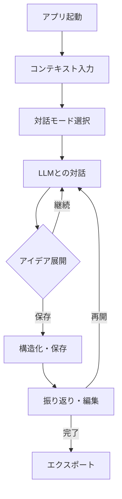
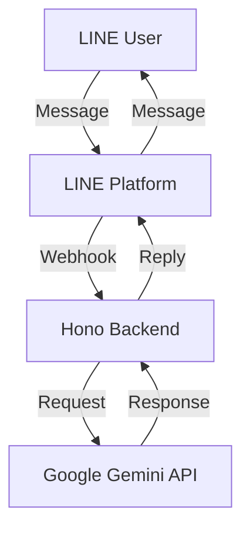

# PRD_建設的会話を促すアプリ案v3

## 1. はじめに

このドキュメントは、ConstructiveTalkの製品要件を詳細に記述したものです。アプリは、ユーザーがLLMと対話し、創造的なアイデアを引き出すことを目的としています。

## 2. モチベーションと検証したい価値

### 2.1  モチベーション

本サービスを開発するに至った背景と動機は、開発者自身の経験と観察、および一般的な創造性の課題に基づいています：

### 創造的な対話の課題

【開発者自身の経験から】
- 基本的に自己肯定感が特に高くなく、しらふの時にアイデアを出そうとしても出にくい
- 幼少期は創造的なタイプだったが、大人になるにつれて評価懸念により創造性が抑制される傾向
- アルコール摂取時に創造的なアイディアが出やすい現象の観察

【一般的な課題として】
- 多くの人が新しいアイデアを考える際に、評価懸念や自己批判により創造性が阻害されている
- 一人でアイデアを考えると、視野が狭くなりがちで、新しい視点を得にくい
- 対話相手がいても、相手の立場や関係性により、自由な発想を共有しづらい場合がある

### LLMによる解決可能性

【開発者の期待】
- 評価や批判を気にせず、自由に発想を広げられる対話相手としての可能性
- 自分のペースに合わせた創造的な対話の実現
- 思考の整理と構造化のサポート

【一般的な利点】
- LLMは評価や批判なしに、建設的なフィードバックを提供できる
- 多様な視点からの質問やプロンプトにより、ユーザーの思考を広げることができる
- 24時間いつでも対話が可能で、ユーザーのペースに合わせた創造的な対話が実現できる

### 既存ツールの限界

- 従来の発想支援ツールは一方向的で、真の対話型の支援が不足している
- アイデアの記録と整理が別々のツールで行われ、シームレスな体験が得られていない
- コンテキスト情報を含めた包括的なアイデア管理が困難

### 2.2 検証したい最大の価値

**コア価値命題：**
「評価懸念のない対話環境での創造性の解放と、アイデアの持続的な発展」

#### 既存ツールの限界
1. **チャットツール（Slack, Discord等）**
   - 評価懸念が残る
   - 会話の文脈が保持されにくい
   - 創造性に特化していない

2. **アイデア管理ツール（Notion, Evernote等）**
   - 一方向的な記録のみ
   - 対話による発想の展開がない
   - コンテキスト情報の管理が不十分

3. **AI チャットボット（ChatGPT等）**
   - 創造性に特化していない
   - 会話の継続性が低い
   - パーソナライズされていない

## 3. ターゲットユーザー

### プライマリーターゲット
- 25-40歳の知的職業従事者
- 創造的な仕事や趣味を持つ個人
- テクノロジーに関心がある層

### ペルソナ
1. **クリエイティブワーカー（30代前半）**
   - 広告代理店でコピーライターとして勤務
   - 新しいアイデアを常に求められる
   - 締め切りのプレッシャーを感じている

2. **起業準備中の会社員（35歳）**
   - 新規事業のアイデアを模索中
   - 評価を気にせず自由に発想したい
   - 時間の制約がある

## 4. 機能要件

### 4.1 MUST機能
- **LLMとの対話基盤**
  - 文脈を理解した継続的な会話
  - ユーザーの発言を促すプロンプト生成
  - 会話履歴の保存と検索
  - 定期的な自動保存機能（5分間隔）

- **コンテキスト管理**
  - 時間、場所、気分の記録
  - アルコールレベルの記録（オプション）
  - タグ付けとカテゴリ分類
  - 同日コンテキストの再利用オプション

- **アイデア構造化**
  - 自動的なキーポイントの抽出
  - マインドマップ形式での可視化
  - Markdown形式でのエクスポート

### 4.2 NICE_TO_HAVE機能
- **分析・可視化**
  - 創造性スコアの算出
  - アイデア生成パターンの分析
  - 時系列での進捗可視化
  - コンテキスト再利用の履歴管理

- **コラボレーション**
  - チーム内でのアイデア共有
  - 匿名フィードバック機能
  - アイデアの派生と結合

- **AI強化機能**
  - パーソナライズされた介入
  - 類似アイデアの提案
  - 実現可能性の評価

- **セッション管理の高度化**
  - 複数デバイス間でのセッション同期
  - コンテキスト情報の自動推論
  - カスタマイズ可能な自動保存間隔

## 5. ユーザー体験の流れ

### 5.1 基本フロー



### 5.2 主要なユーザージャーニー
1. **初回利用時**
   - アプリ説明とチュートリアル
   - 基本設定とプリファレンス
   - 簡単な試行セッション

2. **日常的な利用**
   - クイック記録モード
   - 深堀りセッション
   - 定期的な振り返り

3. **チーム利用時**
   - 共有設定
   - フィードバックの収集
   - アイデアの統合

## 6. コンテンツガイドライン

### 6.1 AIアシスタントの性格設定
- フレンドリーで親しみやすい
- 評価や批判を控えめに
- 建設的な質問を投げかける
- ユーモアのある対話を心がける

### 6.2 コミュニケーションスタイル
- **質問のタイプ**
  - オープンエンド型
  - 具体例を求める型
  - 比較検討を促す型

- **フィードバックの方法**
  - 肯定的な強化
  - 建設的な提案
  - 新しい視点の提供

### 6.3 シナリオ設計
- **アイデア出しフェーズ**
  ```
  AI: 面白い視点ですね。それについてもう少し具体的に教えていただけますか？
  User: [アイデアの詳細を説明]
  AI: なるほど。[関連する視点の提示]という方向性はいかがでしょうか？
  ```

- **構造化フェーズ**
  ```
  AI: これまでの話を整理させていただきますと...
  User: [確認や修正]
  AI: では、次のステップとして[提案]はいかがでしょうか？
  ```

### 6.4 メッセージトーン
- 励ましと支援を基調とする
- 専門用語は適度に
- 親しみやすい日本語
- 敬語は丁寧すぎない程度に

## 7. 技術要件とセキュリティ

### 7.1 システム要件
- レスポンス時間：2秒以内
- 99.9%の可用性
- エンドツーエンドの暗号化

### 7.2 データ保護
- ユーザーデータの暗号化
- 定期的なバックアップ
- アクセス権限の管理

### 7.3 使用する主要な技術の説明 🔧
私たちのアプリは、以下の技術を使って作られています：

#### 基本となる技術
- **Hono**：軽量で高速なWebフレームワーク
  - 特徴：爆速パフォーマンス、TypeScriptサポート、Web標準の使用
  - 使用目的：LINEボットのバックエンドAPIを構築するため

#### メッセージングプラットフォーム
- **LINE Messaging API (@line/bot-sdk)**：LINEボットの開発SDK
  - 特徴：メッセージング機能、ユーザー管理、Webhook処理
  - 使用目的：ユーザーとLINEを通じて対話するため

#### AI対話機能
- **AI SDK (@ai-sdk/google & ai)**：Google AI（Gemini）との統合
  - 特徴：ストリーミング対応、コンテキスト管理、高度な対話機能
  - 使用目的：自然な対話体験とアイデア生成の支援

#### 開発環境とツール
- **pnpm**：高速なパッケージマネージャー（v8.15.3）
  - 特徴：効率的な依存関係管理、ディスク容量の節約
  - 使用目的：プロジェクトの依存関係を管理するため

- **Biome**：コード品質管理ツール
  - 特徴：リンター、フォーマッター、高速な実行
  - 使用目的：一貫したコードスタイルと品質を維持するため

#### テスト環境
- **Vitest**：高速なテストフレームワーク
  - 特徴：Viteベース、TypeScriptサポート、並列実行
  - 使用目的：ユニットテストと統合テストを実行するため

### 7.4 アーキテクチャ概要



### 7.5 エージェントコンテキスト管理

#### システムプロンプト構成
- **基本コンテキスト**
  - PRDの内容を常時参照可能な形で保持
  - アプリケーションの目的と価値提案
  - コミュニケーションガイドライン

#### コンテキスト注入の実装
```typescript
// Honoミドルウェアでの実装例
const systemPromptMiddleware = async (c: Context, next: Next) => {
  const prd = await readPRDContent(); // PRDの内容を読み込む
  c.set('systemPrompt', {
    role: 'system',
    content: `
      あなたは建設的な対話を促進するAIアシスタントです。
      以下のPRDに基づいて応答を行ってください：
      ${prd}
    `
  });
  await next();
};
```

#### コンテキスト管理の特徴
- PRDの内容を動的に更新可能
- セッションごとのコンテキスト保持
- メモリ効率を考慮した最適化

## 8. 成功指標（KPI）

### 8.1 ユーザー指標
- DAU/MAU比率
- セッション継続時間
- リピート率

### 8.2 品質指標
- ユーザー満足度
- アイデア実現率
- バグ報告数

### 8.3 ビジネス指標
- ユーザー獲得コスト
- 継続率
- 収益性指標 