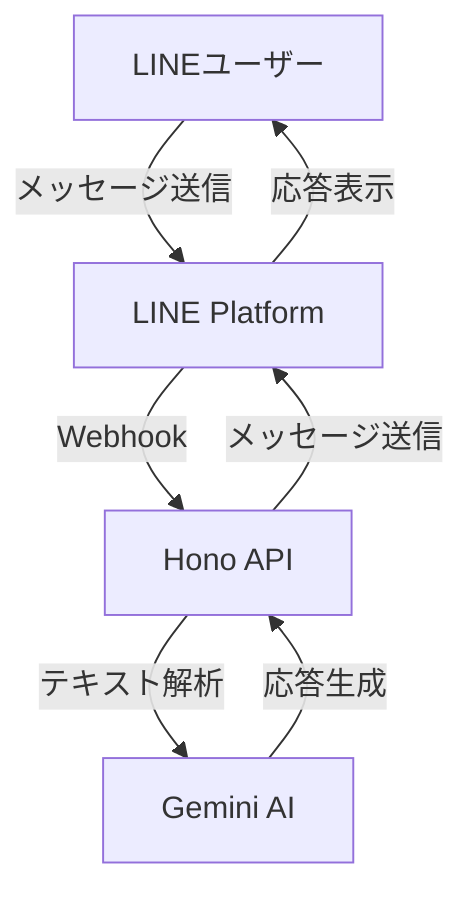

# Constructive LINE Bot

建設的な対話を促進するLINE Botアプリケーション。

## 機能

- LINEを通じたAIとの対話
- 建設的な会話の促進
- コンテキストを考慮した応答
- アイデアの構造化と保存

## 技術スタック

### フレームワーク・ライブラリ

- [Hono](https://hono.dev/) - 軽量で高速なWebフレームワーク
- [LINE Messaging API](https://developers.line.biz/ja/services/messaging-api/) - LINEボット開発SDK
- [Google AI (Gemini)](https://ai.google.dev/) - 自然言語処理AI

### 開発ツール

- [TypeScript](https://www.typescriptlang.org/) - 型安全な開発
- [Bun](https://bun.sh/) - 高速なJavaScriptランタイム＆ビルドツール
- [Vitest](https://vitest.dev/) - テストフレームワーク
- [Biome](https://biomejs.dev/) - リンター＆フォーマッター

## プロジェクト構成

```
src/
├── config/     - 設定ファイル
├── services/   - ビジネスロジック
├── handlers/   - ルートハンドラー
├── types/      - 型定義
└── utils/      - ユーティリティ関数
```

## システム構成



## 開発環境構築

### 依存関係のインストール

```bash
# パッケージのインストール
bun install
```

### 環境変数の設定

1. `.env.example`をコピーして`.env`を作成

```bash
cp .env.example .env
```

2. `.env`ファイルを編集し、以下の環境変数を設定してください：

```bash
LINE_CHANNEL_SECRET=your_line_channel_secret
LINE_CHANNEL_ACCESS_TOKEN=your_line_channel_access_token
GOOGLE_API_KEY=your_google_api_key
```

### 開発サーバーの起動

```bash
# 開発サーバーを起動
bun dev
```

### 利用可能なコマンド

- `bun dev` - 開発サーバーの起動
- `bun build` - プロダクションビルド
- `bun test` - テストの実行
- `bun lint` - コードの静的解析
- `bun format` - コードの自動フォーマット